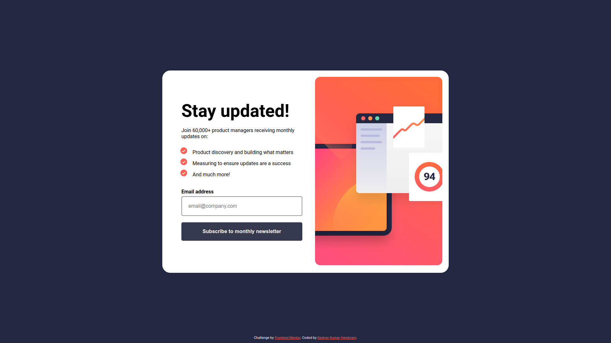
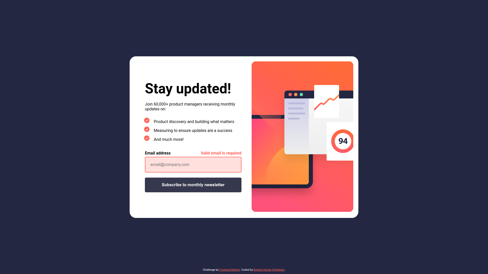
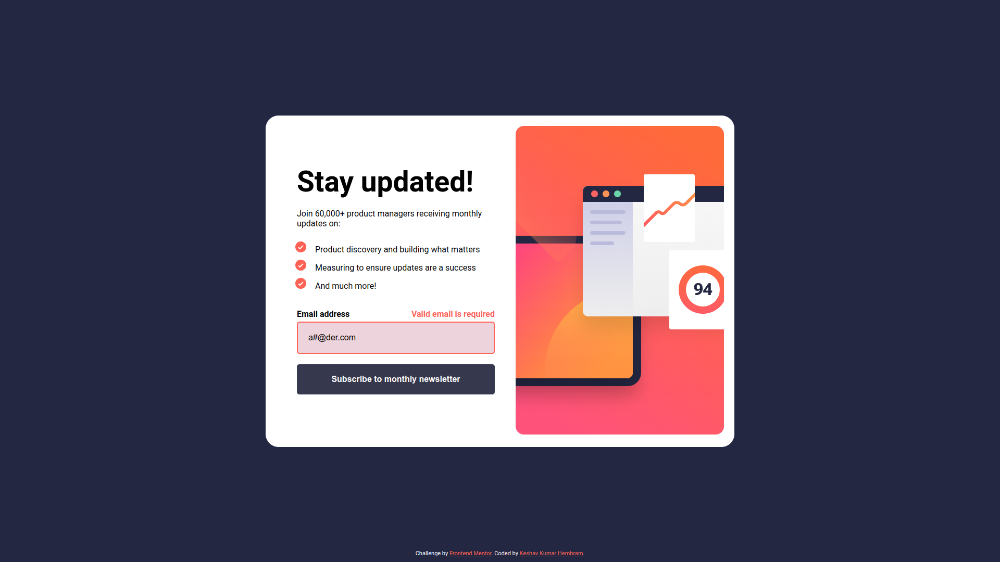
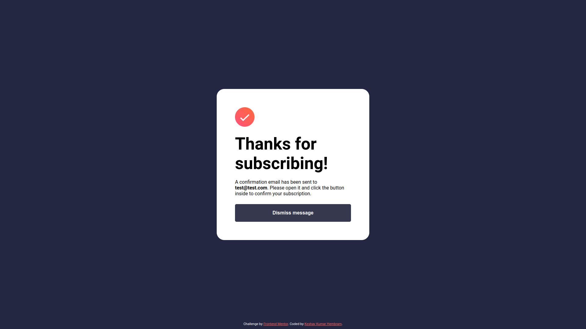
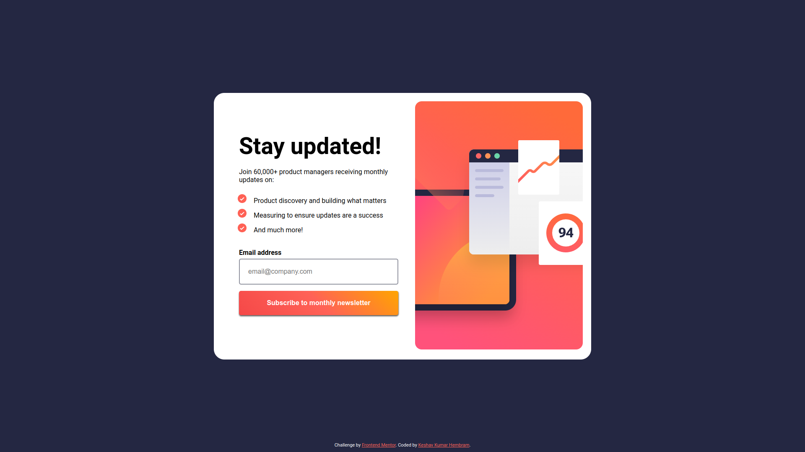

# Frontend Mentor - Newsletter sign-up form with success message solution

This is a solution to the [Newsletter sign-up form with success message challenge on Frontend Mentor](https://www.frontendmentor.io/challenges/newsletter-signup-form-with-success-message-3FC1AZbNrv). Frontend Mentor challenges help you improve your coding skills by building realistic projects.

## Table of contents

- [Overview](#overview)
  - [The challenge](#the-challenge)
  - [Links](#links)
  - [Screenshot](#screenshot)
- [My process](#my-process)
  - [Built with](#built-with)
  - [What I learned](#what-i-learned)
  - [Continued development](#continued-development)
  - [Useful resources](#useful-resources)
- [Author](#author)
- [Acknowledgments](#acknowledgments)

## Overview

### The challenge

Users should be able to:

- Add their email and submit the form
- See a success message with their email after successfully submitting the form
- See form validation messages if:
  - The field is left empty
  - The email address is not formatted correctly
- View the optimal layout for the interface depending on their device's screen size
- See hover and focus states for all interactive elements on the page

### Links

- Solution URL: [https://github.com/keshavkumarhembram/fm-newsletter-sign-up-with-success-message-main](https://github.com/keshavkumarhembram/fm-newsletter-sign-up-with-success-message-main)

- Live Site URL: [https://keshavkumarhembram.github.io/fm-newsletter-sign-up-with-success-message-main/](https://keshavkumarhembram.github.io/fm-newsletter-sign-up-with-success-message-main/)

### Screenshot

- Desktop view



- Empty error



- Invalid Error



- Successful



- Hover Button



## My process

### Built with

- Semantic HTML5 markup
- CSS custom properties
- Flexbox

### What I learned

- #### How to increase distance between list style and list item

```css
li {
  padding-left: 20px;
}
```

- #### list style positon can be changed

```css
ul {
  list-style-position: inside;
}
```

- #### how to deal with default autofil style

```css
/* line 170 */
.error:-webkit-autofill {
  -webkit-box-shadow: 0 0 0px 1000px hsla(4, 100%, 67%, 0.2) inset;
}
```

### Continued development

Till now I have done projects using html, css and vanila javascript. Now I will try to work on react, which I have been learning. My next project will be using react.

### Useful resources

- I was stuck due to `input:-webkit-autofill` default styling, this article helped me:- [How to avoid "-internal-autofill-selected" style to be applied?](https://9to5answer.com/how-to-avoid-quot-internal-autofill-selected-quot-style-to-be-applied)

- How to redirect to some other page?
  [How TO - Redirect to Another Webpage](https://www.w3schools.com/howto/howto_js_redirect_webpage.asp)

## Author

- Github - [keshavkumarhembram](https://github.com/keshavkumarhembram)
- Frontend Mentor - [@keshavkumarhembram](https://www.frontendmentor.io/profile/keshavkumarhembram)
- Twitter - [@keshavhembram](https://twitter.com/keshavhembram)

## Acknowledgments

- [stackoverflow](https://stackoverflow.com/)
- [w3school](https://www.w3schools.com/)
